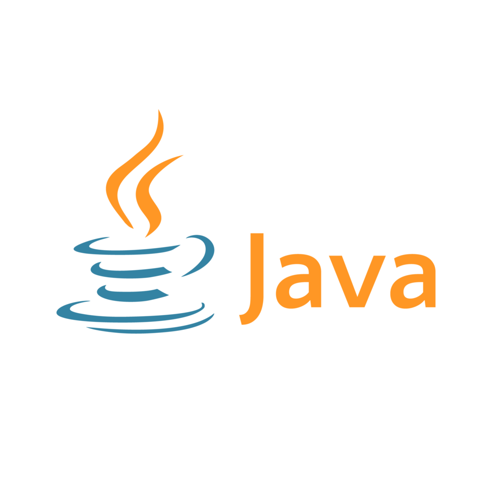

#  Problem Set Solutions in 

Welcome to the **CSES Problem Set Solutions** repository! This project aims to provide efficient and well-documented Java solutions for the [CSES Problem Set](https://cses.fi/problemset/) platform.

## 📖 Current Progress

Here's a quick look at the progress so far:

  

    12/300
  

<h2 style="color: #ffffff;">CSES Problem Set Progress</h2>
<table style="width: 100%; max-width: 800px; border-collapse: collapse; margin: auto; background-color: #2e2e2e; color: #ffffff;">
  <tr>
    <th style="border: 1px solid #444444; padding: 8px; background-color: #3b3b3b;">Section</th>
    <th style="border: 1px solid #444444; padding: 8px; background-color: #3b3b3b;">Progress</th>
  </tr>
  <tr>
    <td style="border: 1px solid #444444; padding: 8px;">Introductory Problems</td>
    <td style="border: 1px solid #444444; padding: 8px;">
      

        

        12/19
      

    </td>
  </tr>
  <tr>
    <td style="border: 1px solid #444444; padding: 8px;">Sorting and Searching</td>
    <td style="border: 1px solid #444444; padding: 8px;">
      

        

        0/35
      

    </td>
  </tr>
  <tr>
    <td style="border: 1px solid #444444; padding: 8px;">Dynamic Programming</td>
    <td style="border: 1px solid #444444; padding: 8px;">
      

        

        0/19
      

    </td>
  </tr>
  <tr>
    <td style="border: 1px solid #444444; padding: 8px;">Graph Algorithms</td>
    <td style="border: 1px solid #444444; padding: 8px;">
      

        

        0/36
      

    </td>
  </tr>
    <tr>
    <td style="border: 1px solid #444444; padding: 8px;">Range Quaries</td>
    <td style="border: 1px solid #444444; padding: 8px;">
      

        

        0/19
      

    </td>
  </tr>
    <tr>
    <td style="border: 1px solid #444444; padding: 8px;">Tree Algorithms</td>
    <td style="border: 1px solid #444444; padding: 8px;">
      

        

        0/16
      

    </td>
  </tr>
  
  <tr>
    <td style="border: 1px solid #444444; padding: 8px;">Mathematics</td>
    <td style="border: 1px solid #444444; padding: 8px;">
      

        

        0/31
      

    </td>
  </tr>
    <tr>
    <td style="border: 1px solid #444444; padding: 8px;">String Algorithms</td>
    <td style="border: 1px solid #444444; padding: 8px;">
      

        

        0/17
      

    </td>
  </tr>
  <tr>
    <td style="border: 1px solid #444444; padding: 8px;">Geometry</td>
    <td style="border: 1px solid #444444; padding: 8px;">
      

        

        0/7
      

    </td>
  </tr>
      <tr>
    <td style="border: 1px solid #444444; padding: 8px;">Advanced Techniques</td>
    <td style="border: 1px solid #444444; padding: 8px;">
      

        

        0/24
      

    </td>
  </tr>
    <tr>
    <td style="border: 1px solid #444444; padding: 8px;">Advanced Problems</td>
    <td style="border: 1px solid #444444; padding: 8px;">
      

        

        0/77
      

    </td>
  </tr>
</table>

As more problems are solved, this section will be updated to reflect ongoing progress in other topics as well.
